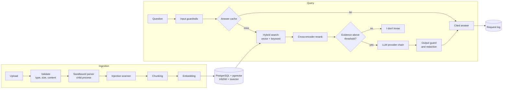

<div align="center">

# Secure RAG Document Q&A

**Grounded, cited answers from your own documents, with measured retrieval quality and layered prompt-injection defenses.**


[Overview](#overview) · [Results](#results) · [Architecture](#architecture) · [Engineering challenges](#engineering-challenges) · [Getting started](#getting-started) · [Evaluation](#evaluation)

</div>

<!-- Demo video: add the YouTube link here once uploaded. -->

## Overview

Secure RAG Document Q&A is a single-user retrieval-augmented generation (RAG) application. Users upload PDF, Word,
HTML, Markdown or plain-text files and ask questions in natural language. Every answer cites the exact source passage,
with its page and section, and the system answers "I don't know" when the documents do not support an answer.

The project focuses on the problems that make RAG hard to trust in practice:

- **Hallucination:** answers are grounded in retrieved passages, citations are validated, and weak evidence is refused.
- **Retrieval quality:** hybrid search and cross-encoder reranking, compared on a labeled evaluation set.
- **Security:** layered defenses against indirect prompt injection hidden in uploaded documents, measured with a red-team suite.
- **Cost and reliability:** exact and semantic caching, per-request cost and latency tracking, and multi-provider fallback.

The full stack runs locally at no cost. Hosted LLM providers are optional.

## Results

All figures are measured on 102 answerable and 21 unanswerable labeled questions over 11 documents (FastAPI
documentation, two NIST PDFs, a Word handbook and an HTML FAQ). Raw results are committed in
[`backend/evals/results/`](backend/evals/results/).

| Metric | Result |
|---|---|
| Retrieval hit@5 (hybrid + rerank) | **0.91**, vs 0.61 for keyword search |
| Retrieval hit@1 (hybrid + rerank) | **0.74**, vs 0.66 for vector search |
| Answer success (answered with a supporting citation) | **0.82** |
| Unanswerable questions refused | **21 / 21**, 0 leaks |
| Prompt-injection attack success rate (40 attacks) | **47.5% → 0%** |
| Legitimate answers preserved on poisoned documents | **100%** (16 / 16) |
| False positives on benign data | **0** of 130 questions, **0** of 474 chunks |
| Cache savings (90-request replay) | **−56%** LLM calls, **−54.5%** estimated cost, **−47%** latency |
| Answer latency (RTX 5070 Ti, llama3.1:8b) | p50 **544 ms**, p95 **956 ms** |

## Features

| Area | Capabilities |
|---|---|
| **Ingestion** | PDF, DOCX, HTML, Markdown and TXT · content-sniffed validation · sandboxed parsing · per-file status and errors |
| **Indexing** | Heading-aware and fixed-size chunking · `bge-large-en-v1.5` embeddings · pgvector HNSW index · Postgres full-text index |
| **Retrieval** | Vector, keyword and hybrid (reciprocal rank fusion) search · `bge-reranker-v2-m3` cross-encoder · file-type and document filters |
| **Answering** | Validated `[n]` citations linked to the source passage and page · two-level refusal · five explicit answer statuses |
| **Caching** | Exact and semantic answer cache · automatic invalidation on document or settings changes |
| **Reliability** | Provider chain (OpenAI → Gemini → OpenRouter → Ollama) · retries with backoff · timeouts · provider cool-down |
| **Security** | Input guardrails · ingestion scanner · untrusted-context prompting · output guard · PII and secret redaction · rate limiting · strict CSP |
| **Observability** | Per-request tokens, cost, latency and cache status · metrics dashboard with p50/p95 latency and error rate |
| **Interface** | Library, Chat and Metrics pages · clickable citations that open the source passage · light and dark themes |

## Architecture



### Request lifecycle

1. **Input guardrails** enforce length and rate limits and block known attack patterns.
2. **Exact and semantic caches** are checked. A hit returns immediately without a model call.
3. **Hybrid search** retrieves candidates from the vector and keyword indexes and merges them with reciprocal rank fusion.
4. **The cross-encoder** reranks the top 20 candidates and keeps the top 5.
5. **The refusal check** returns "I don't know" if the best similarity is below the calibrated threshold.
6. **The LLM** receives the passages wrapped in delimiters and marked as untrusted data, with retries and provider fallback.
7. **The output guard** validates citations, blocks system-prompt leakage, strips untrusted links and redacts sensitive data.
8. **The request** is logged with tokens, estimated cost, latency and cache status. Question and answer text are never stored.

### Components

| Component | Responsibility |
|---|---|
| `app/main.py` | Thin FastAPI layer: routing, validation and dependency wiring only |
| `app/parsers/` | One parser per format, all producing a normalized `ParsedSection` (text, page, heading, source) |
| `app/sandbox.py`, `app/parse_worker.py` | Runs PDF and DOCX parsing in a resource-limited child process |
| `app/scanner.py` | Detects and removes injected instructions and invisible characters at ingestion |
| `app/chunking.py`, `app/embeddings.py` | Chunking strategies and embedding model interface |
| `app/retrieval.py`, `app/rerank.py` | Vector, keyword and hybrid search, and cross-encoder reranking |
| `app/answering.py` | Prompt construction, refusal logic, citation validation and answer statuses |
| `app/providers.py`, `app/resilient.py` | LLM adapters and the retry, timeout and fallback chain |
| `app/cache.py` | Exact and semantic answer cache with scope- and corpus-based invalidation |
| `app/guardrails.py`, `app/output_guard.py`, `app/redact.py` | Input, output and data-protection security layers |
| `app/metrics.py` | Request logging, cost estimation and metrics aggregation |
| `app/web.py` | Production entry point: API under `/api`, React app at `/`, security headers |

### Key design decisions

| Decision | Alternatives considered | Rationale |
|---|---|---|
| PostgreSQL + pgvector for vectors and full-text | Dedicated vector DB (Qdrant, Pinecone) | One store, one transaction, no joins for hybrid search, and a `tsvector` column generated by the database so keyword search never drifts |
| HNSW index (cosine) | IVFFlat | No training step and better recall at this scale |
| Raw SQL with psycopg 3 and Alembic | ORM | Few, performance-sensitive queries that use pgvector-specific features directly |
| pdfplumber for PDF | PyMuPDF | MIT licence (PyMuPDF is AGPL) and per-word font metadata for heading detection |
| Reciprocal rank fusion | Weighted score fusion | Combines ranks without normalizing incompatible score scales. Weighted fusion measured worse |
| `bge-reranker-v2-m3` | `bge-reranker-base` | The base model failed on paraphrased questions; v2-m3 added +9 points hit@1 |
| Two-level refusal (threshold, then model) | Similarity threshold only | On-topic but unanswerable questions score as high as real ones, so a threshold alone cannot catch them |
| Paragraph-level sanitization | Quarantining the whole chunk | Raised legitimate-answer retention on poisoned documents from 11% to 100% |
| Cache keyed by settings and corpus fingerprint | Explicit cache clearing | Invalidation happens automatically and cannot be forgotten |

## Engineering challenges

### 1. Hallucination and unsupported answers

**Problem.** LLMs answer confidently even when the retrieved context does not contain the answer.

**Solution.** The system refuses before calling the LLM when the best similarity score falls below a threshold of 0.48,
calibrated from data rather than guessed. Calibration showed that on-topic but unanswerable questions score in the same
range as answerable ones (0.57–0.69), so the model is also instructed to decline, and the two outcomes are reported as
separate statuses. Citations are validated against the retrieved set and invented references are discarded. Replies that
contain only a citation number, a failure mode found by the evaluation, are detected and retried once.

**Outcome.** 0.82 answer success, 21 of 21 unanswerable questions refused, and all citation-only replies eliminated.

### 2. Heterogeneous and messy document formats

**Problem.** Real documents break naive parsers, and parser defects silently degrade retrieval.

**Solution.** Format-specific parsers feed one normalized structure. Testing on real NIST publications exposed and fixed:

- words merged by fixed-width gap detection (gap is now relative to font size);
- running headers repeated on every page (detected statistically and removed: 313 → 270 sections);
- small-caps headings split into fragments (lines are grouped by baseline and merged);
- figure captions mistaken for section headings;
- visually hidden HTML content (stripped, verified with a hidden decoy fact in the evaluation set).

**Outcome.** Retrieval hit@5 of 0.88 on PDF, 0.91 on Markdown and 1.00 on Word and HTML.

### 3. Retrieval quality

**Problem.** It is not obvious which retrieval strategy works best, and small evaluation sets give misleading answers.

**Solution.** Five retrieval configurations were benchmarked on the same labeled set:

| Mode | hit@1 | hit@5 | MRR |
|---|---|---|---|
| Keyword | 0.30 | 0.61 | 0.424 |
| Hybrid (RRF) | 0.54 | 0.84 | 0.657 |
| Vector | 0.66 | 0.89 | 0.744 |
| Vector + rerank | **0.75** | **0.91** | **0.818** |
| Hybrid + rerank (production) | 0.74 | 0.91 | 0.811 |

An early 32-question set suggested `bge-reranker-base` was a clear win. Expanding to a harder, mostly paraphrased set
reversed that result, and the reranker was replaced with `bge-reranker-v2-m3`. Weighted fusion, reranking without
heading context and alternative pool sizes were tested and rejected. The refusal threshold uses the best score across
the full candidate pool so reranking cannot turn a strong match into a refusal.

**Outcome.** +9 points hit@1 and +0.07 MRR over vector search alone.

### 4. Measuring quality reliably

**Problem.** Without measurement, changes to chunking, retrieval or prompts are guesswork.

**Solution.** A labeled evaluation set with source quotes, one command per evaluation and timestamped JSON results.
The answer evaluation records whether the evidence reached the LLM's context (0.91 of questions), separating retrieval
failures from generation failures. Two methodology issues were found and corrected:

- **Evaluation contamination:** a duplicate document in the database displaced correct results. Evaluations are now
  scoped to their own documents.
- **Unreliable LLM-as-judge:** self-grading by llama3.1:8b rated 97% of answers correct, including clearly wrong ones.
  It was demoted to an optional second opinion.

### 5. Cost and latency

**Problem.** Repeated and reworded questions pay full LLM cost and latency.

**Solution.** An exact-match cache and a semantic cache. The semantic threshold (cosine 0.95) was chosen from 30
rewordings and 14 near-miss questions as the lowest value with zero incorrect hits. Each entry is keyed by the active
settings and a fingerprint of the indexed documents, so changes invalidate stale answers automatically. Only grounded
answers are cached, and cache failures fall back to normal answering.

**Outcome.** On a 90-request replay: LLM calls 90 → 40, average latency 681 → 358 ms, estimated cost −54.5%, zero
incorrect cache hits.

### 6. Provider reliability

**Problem.** Hosted LLM APIs time out, rate-limit and fail.

**Solution.** A provider chain behind a single `generate()` interface. Configured hosted providers are tried first and
local Ollama is always the final fallback. Connection errors and HTTP 429/5xx responses are retried with exponential
backoff. Timeouts skip directly to the next provider, and a failed provider is bypassed for 30 seconds. Ingestion is
transactional, so a failed upload never leaves a partially indexed document.

### 7. Indirect prompt injection

**Problem.** Uploaded documents can contain instructions that the LLM follows.

**Solution.** Six independent layers, each measured in isolation with a 40-case red-team suite (22 direct, 18 hidden in
documents):

| Configuration | Attack success rate |
|---|---|
| No defenses | 47.5% |
| Hardened prompt only | 35.0% |
| Input guardrails only | 22.5% |
| Ingestion scanner only | 22.5% (0% of indirect attacks) |
| Output guard and redaction only | 17.5% |
| **All layers** | **0%** |

No single layer was sufficient because each covers a different attack class. The first scanner quarantined whole chunks
and kept the legitimate answer on only 11% of poisoned documents. Switching to paragraph-level removal raised that to
100% with no loss in protection.

### 8. Untrusted file parsing

**Problem.** Parsing untrusted PDF and Word files is an attack surface (malformed files, zip bombs, resource exhaustion).

**Solution.** Parsing runs in a child process with CPU, memory, time and output limits and no secrets or database access
in its environment. Page-count and uncompressed-size limits guard against decompression bombs, and content sniffing
rejects binary data in text formats. The web layer applies a strict Content-Security-Policy, and the frontend renders all
model and document text as plain text, never as HTML.

## Security model

| Threat | Mitigation |
|---|---|
| Instructions hidden in documents | Ingestion scanner, untrusted-data delimiters, output guard |
| Direct jailbreak and prompt extraction | Input guardrails, system-prompt leak detection |
| Data exfiltration via links | Links to hosts not present in the sources are removed |
| Sensitive data exposure | Redaction of keys, passwords, emails, phone numbers, SSNs and card numbers |
| Malicious files | Sandboxed parsing, size and page limits, content validation |
| Abuse | Per-IP rate limits on questions and uploads |
| Excessive model capability | The LLM has no tools, web, file or code-execution access |
| Secret leakage | API keys only in server environment variables, never logged or sent to the client |

## Getting started

### Prerequisites

- Docker and Docker Compose
- [Ollama](https://ollama.com) with a model pulled: `ollama pull llama3.1:8b`
- Optional: an NVIDIA GPU, and API keys for Gemini, OpenAI or OpenRouter

### Run with Docker

```bash
git clone https://github.com/Monjur14/RAG-Document-QA.git
cd RAG-Document-QA
cp .env.example .env
docker compose up --build
```

Open http://localhost:8000. The API documentation is at http://localhost:8000/api/docs.

To use an NVIDIA GPU:

```bash
docker compose -f docker-compose.yml -f docker-compose.gpu.yml up --build
```

The embedding and reranker models (about 3.5 GB) are downloaded on first use and cached in a Docker volume.

### Local development

```bash
docker compose up -d db                                                 # PostgreSQL + pgvector on port 5433

cd backend
python -m venv .venv && source .venv/bin/activate                       # Windows: .venv\Scripts\activate
pip install torch --index-url https://download.pytorch.org/whl/cu128   # CUDA build of PyTorch
pip install -r requirements.txt
python -m app.db                                                        # apply migrations
uvicorn app.main:app --reload                                           # http://localhost:8000/docs
```

```bash
cd frontend
npm install
npm run dev                                                             # http://localhost:5173
```

### Configuration

Settings are read from environment variables or `.env`. Common options:

| Variable | Default | Description |
|---|---|---|
| `LLM_PROVIDERS` | `auto` | Uses every provider with a key, then falls back to Ollama |
| `OLLAMA_MODEL` | `llama3.1:8b` | Local model |
| `GEMINI_API_KEY`, `OPENAI_API_KEY`, `OPENROUTER_API_KEY` | empty | Optional hosted providers |
| `EMBEDDING_MODEL` | `BAAI/bge-large-en-v1.5` | Sentence-transformers embedding model |
| `RERANK_MODEL` | `BAAI/bge-reranker-v2-m3` | Cross-encoder reranker |
| `MIN_VECTOR_SCORE` | `0.48` | Refusal threshold |
| `SEMANTIC_CACHE_THRESHOLD` | `0.95` | Minimum similarity for a semantic cache hit |
| `ANSWER_TOP_K` | `5` | Passages sent to the LLM |
| `RATE_LIMIT_ASK_PER_MIN` | `30` | Questions per minute per client IP |
| `MAX_UPLOAD_MB` | `20` | Maximum upload size |

## API

In Docker, all endpoints are served under `/api`.

| Method | Endpoint | Description |
|---|---|---|
| `POST` | `/documents/upload` | Upload and index a document |
| `GET` | `/documents` | List documents with status and security flags |
| `DELETE` | `/documents/{id}` | Delete a document and its chunks |
| `POST` | `/search` | Retrieve passages (`vector`, `keyword` or `hybrid`) |
| `POST` | `/ask` | Ask a question and receive a cited answer |
| `GET` | `/metrics` | Request statistics: latency, cost, cache hit rate, errors |
| `GET` | `/evals/latest` | Latest evaluation results |
| `GET` | `/health` | Health check |

```bash
curl -X POST http://localhost:8000/api/ask \
  -H "Content-Type: application/json" \
  -d '{"question": "How do I install Orbit?"}'
```

Every response carries a `status`: `answered`, `insufficient_evidence`, `model_declined`, `uncited` or `blocked`.

## Evaluation

Run from `backend/` with the database and Ollama available. Each run writes a timestamped JSON file to
`backend/evals/results/`, and the Metrics page shows the latest results.

| Command | Measures |
|---|---|
| `python -m evals.fetch_corpus` | Downloads the public corpus from its original sources, verified by SHA-256 |
| `python -m evals.make_own_corpus` | Generates the Word and HTML test documents |
| `python -m evals.corpus_eval` | Retrieval hit@1/3/5 and MRR by mode, format and question type |
| `python -m evals.answer_eval` | Answer success, citation support, refusals, leaks, latency and tokens |
| `python -m evals.threshold_eval` | Refusal threshold calibration |
| `python -m evals.cache_eval` | Semantic cache threshold selection and replay benchmark |
| `python -m evals.redteam_eval` | Attack success rate; `--naive` for no defenses, `--layers <name>` for one layer |

## Testing

```bash
cd backend && pytest          # ~200 tests: parsers, retrieval, answering, cache, security, API, migrations
cd frontend && npm test       # Vitest + Testing Library
```

The embedder, reranker and LLM are replaced by deterministic fakes, so the backend suite needs no GPU or model download.
Database tests are skipped when PostgreSQL is not running.

## Project structure

```
├── backend/
│   ├── app/              FastAPI application and core modules
│   │   └── parsers/      One parser per document format
│   ├── evals/            Evaluation scripts, labeled datasets and results
│   ├── migrations/       Alembic migrations
│   └── tests/            Unit, API and migration tests
├── frontend/             React + TypeScript UI (Vite, Tailwind, TanStack Query)
├── demo/                 Playwright-based demo video recorder
├── docker/               Container entrypoint
├── Dockerfile            Multi-stage build: frontend + Python app
└── docker-compose.yml    PostgreSQL + application
```

## Known limitations

- Questions that require combining several passages or documents are not yet handled well.
- The evaluation set (102 questions) is modest; differences of one or two questions are within noise.
- The red-team cases were written alongside the defenses, so the 0% attack success rate is an upper bound.
- Rule-based guardrails can be bypassed by unseen phrasing, and false statements in a document cannot be detected.
- Rate limiting is in-memory and per process.
- Scanned PDFs (no OCR), borderless tables and multi-column layouts are not supported.
