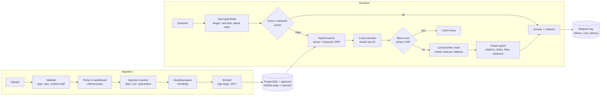

# Secure RAG Document Q&A

Upload your own documents (PDF, Word, HTML, Markdown, text), ask questions in plain language, and get answers that cite
the exact passage and page they came from. When the documents don't support an answer, the app says "I don't know"
instead of guessing. It also defends against prompt injection hidden inside uploaded files.

Every quality claim below was measured on a labeled eval set. The result files are committed in
[`backend/evals/results/`](backend/evals/results/).

<!-- Demo video: add the YouTube link here once uploaded. -->

**Stack:** Python, FastAPI, PostgreSQL + pgvector, sentence-transformers (`bge-large-en-v1.5`), cross-encoder reranker
(`bge-reranker-v2-m3`), Ollama (`llama3.1:8b`) with Gemini / OpenAI / OpenRouter adapters, React 19 + TypeScript + Vite +
Tailwind, Docker Compose. Runs entirely locally at $0.

## Results at a glance

Measured on 102 answerable and 21 unanswerable questions over 11 documents (FastAPI docs, two NIST PDFs, a Word handbook
and an HTML FAQ).

| What | Result |
|---|---|
| Retrieval hit@5 (right passage in the top 5) | **0.91** with hybrid search + reranking, vs 0.61 for keyword search alone |
| Retrieval hit@1 | **0.74**, up from 0.66 for vector search alone |
| Answer success (answered, and a cited passage contains the labeled evidence) | **0.82** |
| Unanswerable questions correctly refused | **21 / 21**, with 0 leaks |
| Prompt-injection attack success rate (40 attacks) | **48% → 0%** with all defense layers |
| Legitimate answers kept on poisoned documents | **100%** (16 / 16) |
| False positives | 0 of 130 benign questions blocked, 0 of 474 chunks flagged |
| Semantic + exact cache (90-request replay) | LLM calls −56%, estimated cost −54.5%, avg latency −47%, 0 wrong hits |
| Answer latency (GPU, llama3.1:8b) | p50 544 ms, p95 956 ms |

## Architecture



- **Thin API layer.** `backend/app/main.py` only wires HTTP to plain Python modules (`parsers/`, `chunking.py`,
  `retrieval.py`, `rerank.py`, `answering.py`, `cache.py`, `guardrails.py`, `scanner.py`, `output_guard.py`,
  `redact.py`, `resilient.py`), so each piece is unit-tested without a server.
- **One table for hybrid search.** Text, metadata, the 1024-d vector (HNSW, cosine) and a generated `tsvector` column
  live on the same `chunks` rows, so hybrid search needs no joins and keyword search can never drift out of sync.
- **One origin.** In Docker, `backend/app/web.py` serves the API under `/api` and the built React app at `/`, so there is
  no CORS and a strict Content-Security-Policy applies to every page.

## Engineering problems solved

### 1. LLMs hallucinate and know nothing about private documents

**Approach:** ground every answer in retrieved passages, force citations, and refuse at two levels.

- The app refuses **before calling the LLM** when the best similarity score is below a threshold. That threshold
  (0.48) was calibrated with `evals.threshold_eval`, not guessed.
- Calibration showed something important: on-topic questions the documents *don't* answer ("How much does Orbit
  cost?") score 0.57–0.69, inside the range of real answers. No threshold can catch them. So the model is also told
  to decline, and the two cases show as separate statuses (`insufficient_evidence` vs `model_declined`). In the eval, 14
  of the 20 refusals came from the model, not the threshold.
- Citations are checked against the retrieved set, and numbers the model invents are dropped. There are five answer
  statuses (`answered`, `insufficient_evidence`, `model_declined`, `uncited`, `blocked`) instead of a yes/no, so the UI
  and the evals can tell failure modes apart.
- The eval found a llama3.1:8b quirk: sometimes it replied with only `[2]`. Those replies are now flagged `uncited` and
  retried once with a stricter instruction, which removed all 5 cases.

**Result:** answer success 0.82 (direct questions 0.92, table questions 1.00), and 21 / 21 unanswerable questions refused
with no leaks. The unanswerable set covers off-topic, not-covered, false-premise and injection questions.

### 2. Messy file formats

**Approach:** one parser per format, all producing the same `ParsedSection` (text, page, heading, source file), so
chunking and retrieval never care about the format.

Bugs found on real documents and fixed:

- **Glued words in PDFs.** pdfplumber's fixed 3 pt word gap turned the NIST PDF into "Riskmanagementrefers…", which hurt
  both embeddings and keyword search. Fixed by making the gap relative to font size.
- **Running headers on every page.** A chunk started with "NIST AI 100-1 AI RMF 1.0". Lines that repeat in the top or
  bottom band on at least 30% of pages are now removed (the NIST AI RMF went from 313 to 270 sections).
- **Small-caps headings** were split so "GOVERN" became the heading "OVERN". Lines are now grouped by baseline and the
  capitals merged.
- **Figure captions** ("Fig. 3 …") were replacing real section headings. Captions are no longer treated as headings.
- **Hidden HTML text.** Visually hidden elements are dropped. The eval includes a hidden decoy fact ("lifetime free
  storage of 10 TB") that never reaches a chunk and is never repeated.

I chose pdfplumber (MIT) over PyMuPDF (AGPL) for licensing. Word headings come from styles, merged table cells are
de-duplicated, and ruled PDF tables are extracted once, row by row.

**Result:** retrieval hit@5 by format (hybrid + rerank): PDF 0.88, Markdown 0.91, Word 1.00, HTML 1.00.

### 3. Retrieval quality

**Approach:** three search modes behind one function (vector, keyword, hybrid with reciprocal rank fusion), plus a
cross-encoder reranking a pool of 20 candidates. All of them are measured.

| Mode (102 questions) | hit@1 | hit@5 | MRR |
|---|---|---|---|
| Keyword only | 0.30 | 0.61 | 0.42 |
| Hybrid (RRF) | 0.54 | 0.84 | 0.66 |
| Vector | 0.66 | 0.89 | 0.74 |
| Vector + rerank | **0.75** | **0.91** | **0.82** |
| Hybrid + rerank (used by `/ask`) | 0.74 | 0.91 | 0.81 |

- **A harder eval reversed an earlier conclusion.** On 32 easy questions that reuse the document's words,
  `bge-reranker-base` looked like a big win. On 82 questions, most of them paraphrased, it was no better than plain vector
  search: it helped word-overlap questions and hurt paraphrases. I switched to `bge-reranker-v2-m3`, which is clearly
  better (+9 points hit@1, +0.07 MRR over vector alone).
- **Plain hybrid was worse than vector alone** on this set (hit@5 0.84 vs 0.89), because the keyword list is weak and
  RRF weights it equally. After reranking the two tie. Hybrid stays the default for `/ask` because exact identifiers and
  code names are keyword-friendly.
- Tested and rejected: weighted fusion (worse), reranking without the heading text
  (hit@1 fell to 0.45), and different pool sizes (no difference).
- The chunk's section heading is added to the text that gets embedded, but not to the stored text, so short passages
  keep their context.
- The refusal threshold uses the best cosine score in the **whole candidate pool**, not just the reranked top k.
  Otherwise the reranker pushing a strong match out of the top k could turn a good question into "I don't know".

### 4. Measuring quality instead of guessing

**Approach:** a labeled eval set (102 answerable questions with the source quote, 21 unanswerable), one command per eval,
and timestamped JSON result files so runs can be compared.

- **The eval separates retrieval failures from generation failures** by recording whether the evidence was in the
  context the LLM saw (it was for 0.91 of questions).
- **Eval contamination found and fixed.** After a parser fix the scores *dropped*. The cause was a duplicate copy of a
  NIST PDF in the dev database, whose identical chunks filled the top-k slots. The eval now searches only its own
  documents, and it reports how many other documents are in the database.
- **LLM-as-judge rejected.** Using llama3.1:8b to grade its own answers rated 97% correct and accepted clearly wrong ones.
  It is kept only as an optional second opinion (`--judge`).
- The public corpus is downloaded from its original sources with SHA-256 checks (`evals.fetch_corpus`), so the repo
  never redistributes other people's documents.

### 5. Cost and latency

**Approach:** an exact-match cache plus a semantic cache, and a log row for every request (status, cache result, model,
tokens, estimated cost, latency). The question and answer text are never stored.

- **Threshold picked from data.** On 30 rewordings and 14 near-miss questions (one word changed so the answer differs,
  such as ReDoc vs Swagger UI), 0.95 was the lowest similarity with **0 wrong cache hits**. At 0.94 there were already 2.
- **Invalidation can't be forgotten.** Each cache entry is keyed by the settings (model, prompt, k, mode, threshold,
  reranker, filters) and a fingerprint of the current documents. Uploading or deleting a document makes old entries stop
  matching, so there is no "clear cache" step.
- Only `answered` results are cached, and a cache failure falls back to answering normally.

**Replay benchmark (90 requests):** LLM calls 90 → 40, average latency 681 → 358 ms, tokens −54%, estimated cost −54.5%
(priced as gpt-4o-mini; local models cost $0), 0 wrong hits. Two thirds of this workload is repeats or rewordings, so the
savings are an upper bound. The real hit rate is what the Metrics page shows.

### 6. Reliability when LLM APIs fail

**Approach:** a provider chain behind one `generate(prompt, system)` interface. Hosted providers that have a key
(OpenAI, Gemini, OpenRouter) are tried first, and local Ollama is always last, so the app runs fully offline with no
keys.

- Connection errors and HTTP 429/5xx are retried with exponential backoff (0.5 s, 1 s).
- A timeout is **not** retried. It moves straight to the next provider, because a slow provider would only make the
  user wait longer.
- A failed provider is skipped for 30 s, so a dead one doesn't add retry delays to every request.
- Ingestion is one transaction: a failed upload leaves no half-indexed document and shows in the library as `failed`
  with the reason. Parsing, embedding and SQL run in a threadpool so the async API stays responsive.
- Temperature 0 and an explicit context size keep eval runs repeatable and stop sources from being silently cut off.

### 7. Prompt injection through uploaded documents

**Approach:** layered defenses, each measured one at a time with a 40-case red-team suite (22 direct attacks in the
question, 18 hidden inside documents).

| Layer | What it does |
|---|---|
| Input guardrails | Query length limit, per-IP rate limits, rules for instruction override, prompt extraction, "no limits" role-play and link smuggling |
| Ingestion scanner | Strips zero-width and invisible characters, de-obfuscates leetspeak, cuts out paragraphs that address the AI |
| Prompt structure | Sources wrapped in `<source>` delimiters and marked as untrusted data. Passage text is neutralized so it can't close the tag |
| Output guard | Blocks replies containing runs of the system prompt and removes links to hosts that aren't in the sources |
| Redaction | Masks API keys, passwords, emails, phone numbers, SSNs and Luhn-valid card numbers in answers and cited passages |
| Least privilege | The LLM has no tools, web access, file access or code execution |

| Configuration | Attack success rate |
|---|---|
| Naive prompt, no defenses | 48% (19 / 40) |
| Hardened prompt only | 35% |
| Input guardrails only | 22% |
| Ingestion scanner only | 22% (0% of indirect attacks) |
| Output guard + redaction only | 18% |
| **All layers** | **0% (0 / 40)** |

- **No single layer is enough.** They catch different attacks: the scanner handles indirect attacks only, the guardrails
  handle override and extraction questions, and the output guard and redaction handle secrets, PII and exfiltration links.
- **Utility cost forced a redesign.** The first scanner quarantined the whole chunk containing an injection, which kept
  the legitimate answer on only **11%** of poisoned documents. Cutting out only the offending paragraph raised that to
  **100%** (16 / 16) without letting any attack through.
- **Limits, stated plainly:** I wrote the 40 attacks while building the defenses, so 0% is an upper bound, not an
  estimate of real-world protection. Regex rules can be bypassed by wording they haven't seen. A plain false statement in
  a document can't be detected by any of these layers.

### 8. Untrusted file parsing

**Approach:** PDF and Word parsing runs in a separate child process with time, CPU, memory and output limits
(`setrlimit`), and with no API keys or database access in its environment. There are also limits on PDF page count and
on Word uncompressed size (zip-bomb guard), and content sniffing rejects binary bytes in text formats. A malicious file
costs one failed upload, not the server.

The web layer adds a strict CSP, `X-Content-Type-Options`, frame and referrer policies, and the frontend always renders
LLM and document text as plain text, never as HTML (there's a test for it).

### 9. Reproducibility and developer experience

- `docker compose up --build` starts PostgreSQL with pgvector and the app (API plus built frontend) on one port. A
  multi-stage Dockerfile builds the frontend, runs as a non-root user, has a health check and runs migrations on every
  start.
- Every schema change is an Alembic migration with a working downgrade, and a test runs up, down, up.
- Fakes stand in for the embedder, reranker and LLM, so the ~200 backend tests need no GPU or model download. Database
  tests skip when Postgres isn't running.
- Windows quirks are handled: an `&` in the project path breaks npm's shims (the scripts call `node` directly), and shell
  scripts are forced to LF line endings.
- A Playwright recorder (`demo/`) drives the real app to produce the demo video with captions, a voiceover script and
  subtitles. At the end it checks that every caption matches what the app actually did.

## Quick start

Needs Docker and [Ollama](https://ollama.com) with a model pulled: `ollama pull llama3.1:8b`.

```bash
cp .env.example .env        # optional: API keys and settings
docker compose up --build   # http://localhost:8000
```

- **NVIDIA GPU:** `docker compose -f docker-compose.yml -f docker-compose.gpu.yml up --build` (CUDA 12.8 PyTorch for
  RTX 50-series cards).
- **First upload is slow:** the embedding and reranker models (about 3.5 GB) download once into a Docker volume.
- **Hosted LLMs:** put a Gemini, OpenAI or OpenRouter key in `.env` and that provider is used first, with Ollama as the
  fallback.
- API docs: http://localhost:8000/api/docs. Stop with `docker compose down` (add `-v` to delete the database and
  models).

### Local development

```bash
docker compose up -d db                 # PostgreSQL + pgvector on port 5433

cd backend
python -m venv .venv && source .venv/bin/activate   # Windows: .venv\Scripts\activate
pip install torch --index-url https://download.pytorch.org/whl/cu128   # GPU build first
pip install -r requirements.txt
python -m app.db                        # run migrations
pytest                                  # backend tests
uvicorn app.main:app --reload           # http://localhost:8000/docs
```

Frontend, in a second terminal: `cd frontend && npm install && npm run dev` → http://localhost:5173.
See [`frontend/README.md`](frontend/README.md).

### Try the API

```bash
curl -F "file=@README.md" http://localhost:8000/documents/upload

curl -X POST localhost:8000/ask -H "Content-Type: application/json" \
  -d '{"question": "How do I install Orbit?"}'
# -> answer with [n] citations and a status: answered | insufficient_evidence | model_declined | uncited | blocked
```

Under Docker the same endpoints are under `/api` (for example `http://localhost:8000/api/ask`).

## Running the evals

From `backend/`, with the database and Ollama running:

```bash
python -m evals.fetch_corpus        # download the public corpus (FastAPI docs, NIST PDFs), checked by SHA-256
python -m evals.make_own_corpus     # generate the Word and HTML test documents
python -m evals.corpus_eval         # retrieval: hit@1/3/5 and MRR per mode, per format, per question type
python -m evals.answer_eval         # answers: success, citation support, refusals, leaks, latency, tokens
python -m evals.threshold_eval      # calibrate the "I don't know" threshold
python -m evals.cache_eval          # semantic-cache threshold + replay benchmark
python -m evals.redteam_eval        # 40 attacks; --naive for no defenses, --layers <name> for one layer
```

Each run writes a timestamped JSON file to `backend/evals/results/`. The Metrics page reads the latest ones.

## Project layout

```
backend/app/            FastAPI app and the plain Python modules behind it
backend/app/parsers/    one parser per format -> normalized ParsedSection
backend/migrations/     Alembic migrations (plain SQL)
backend/evals/          eval scripts, labeled question sets, committed results
backend/tests/          unit, API and migration tests
frontend/               React + TypeScript UI: Library, Chat, Metrics
demo/                   Playwright demo-video recorder
Dockerfile              frontend build + Python app in one image
```

## Known limitations

- Cross-document and multi-passage questions are weak (0 of 5 succeed); the top 5 usually comes from one document.
- n = 102 on one machine: differences of 1–2 questions are noise, and runs vary slightly even at temperature 0.
- The Word and HTML test documents were written for this project and are easier than the real NIST PDFs.
- The red-team cases were written alongside the defenses, so the 0% attack success rate is an upper bound.
- Rate limits are in memory, per process.
- Borderless PDF tables, scanned PDFs (no OCR) and multi-column layouts aren't handled.

## Not done yet

- CI on GitHub Actions
- Re-indexing a document from the library
- Comparisons still to run: fixed-size vs heading-aware chunking, exact search vs HNSW, and a second answer model
  (14B or Gemini)
- A single command that runs every eval
